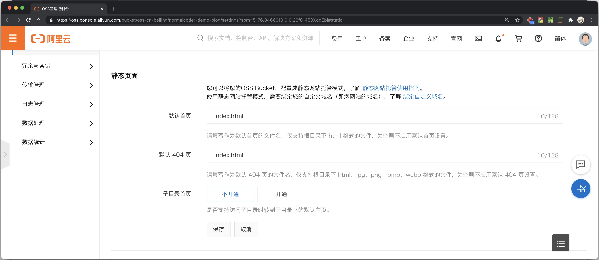
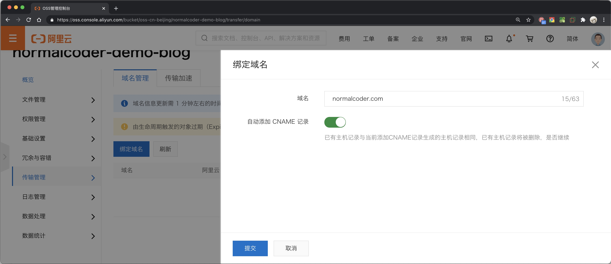
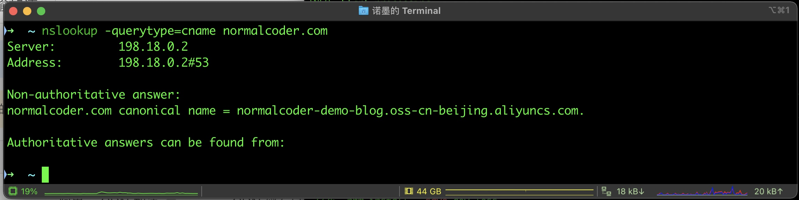
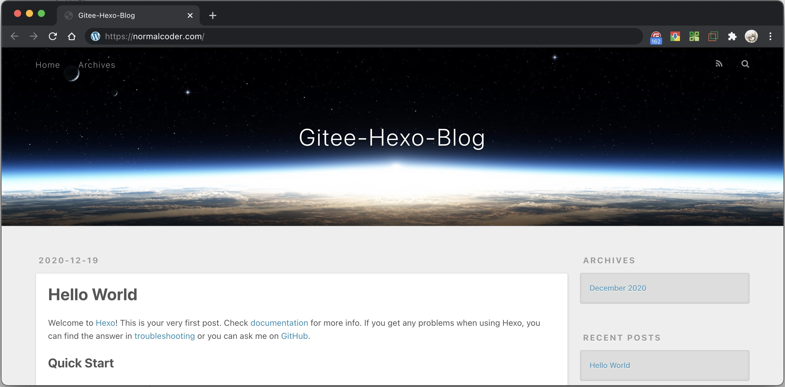

<div align="center">
<p style="font-size:28px !important">《Gitee Go 持续交付之 Hexo 博客部署》</p>
</div>

> 本仓库实战配套视频《从零开始教你Hexo博客自动部署》： https://www.bilibili.com/video/BV1Xv41147EL

[](https://gitee.com/features/gitee-go#production-examples)

## 前言

> - Hexo 是一款基于 `Node.js` 的静态博客框架，依赖少易于安装使用，同时拥有着众多插件和主题，支持 Git、云主机、对象存储等方式部署发布。
> 
> - [Gitee Go] 是 Gitee 推出的 `CI/CD`(持续构建与集成)服务。用户可以通过自定义构建流程，实现构建集成自动化。

在本实战案例中，我们将基于 `Gitee Go` + `Hexo` + `对象存储` 的组合，实现 Hexo 博客的自动化部署发布。

## 环境准备

本次实战基于 `Gitee Go` + `Hexo` + `对象存储`，因此需要准备如下内容：

- 在 Gitee 上创建一个博客仓库并开通 Gitee Go
- 一个 阿里云或腾讯云 的 RAM 帐号，并开通对象存储（OSS/COS）服务，本案例中以 Aliyun OSS 为例，通过该账号创建对象存储和子账号，获得以下内容
    - bucket: 对象存储 Bucket 名称
    - region: 对象存储地域ID（regionID）
    - secretId: RAM 帐号的 AccessKey ID
    - secretKey: RAM 帐号的 AccessKey Sercret
- 一个通过 ICP 已备案域名

## 体验和搭建过程

在本次实战中，你可以根据已有的文档和教程自己搭建 Hexo 站点，并结合 [Gitee Go] 发布部署 Hexo 到 对象存储，也可以按照以下步骤，通过 Fork 本仓库案例。快速体验 [Gitee Go] + Hexo 博客自动部署的便利。

1. 通过 [Gitee Go 活动页面] 领取构建时长。
2. Fork 此仓库，通过仓库导航「`DevOps`」菜单找到并开通 `Gitee Go`。
3. 配置 阿里云 `OSS` 或 腾讯云 `COS` 对象存储。
4. 配置 阿里云 或 腾讯云 相关 `RAM` 帐号。
5. 通过仓库「`管理`」->「`环境变量管理`」添加环境变量内容。
6. 向仓库内添加任意一个文件并提交，触发流水线部署博客。


## Hexo 快速入门

Hexo 的使用和调试 基于 `Node.js`，通过 `npm install -g hexo && npm install -g hexo-cli` 可以将 Hexo 全局安装到系统中调用。也可以通过 `npm install hexo --save` 将 Hexo 集成在当前的项目中。相关 Hexo 命令学习可以通过访问 [Hexo快速入门] 进行学习了解

Hexo 使用 Markdown 语法进行编写，支持常见的 [Markdown](https://daringfireball.net/projects/markdown/) 语法。


## 领取 Gitee Go 免费构建时长

通过访问 [Gitee Go 活动页面]，选择相应需要领取时长的 个人/企业 并领取 500 分钟构建时长


##  配置 OSS 存储

### 创建 OSS Bucket
通过访问阿里云 OSS 控制台 [https://oss.console.aliyun.com/](https://oss.console.aliyun.com/) ，输入 Bucket 名称并选择一个地域，完成 OSS Bucket 创建。通过 [OSS Region和Endpoint对照表] 获得对应的 `RegionID`


### Bucket 静态页面设置

访问对应 OSS Bucket，通过「基础设置」->「静态页面」将 OSS Bucket 配置成静态网站托管模式。默认首页和默认 404 页 设置为 `index.html` 。




### 绑定自定义域名

> 根据阿里云 [【升级】8月13日OSS网页类型文件访问返回Header策略调整通知] ，如果希望使用 OSS 作为静态网站主站，需要绑定一个已备案的域名。

访问对应 OSS Bucket，通过「传输管理」->「域名管理」，输入博客站点的域名，此处以我的博客站点 normalcoder.com 为例，如果域名使用阿里云的域名解析服务，还可以直接勾选「自动添加 CNAME 记录」以完成自动添加 DNS 解析配置。



配置完成后，可以通过页面配置更多如 `CDN 加速`、`域名SSL证书` 等内容。

> 完成配置后，通过 `nslookup` 可以查看 DNS 解析情况。



##  配置相关 RAM 账号与授权

> 现在大多数云服务厂商的服务都可以通过 API 的形式调用，使用 [Gitee Go] 发布博客到 Aliyun OSS 需要开通相应权限的 RAM 帐号，获得对应的 AccessKey 和 SercretKey。

通过访问阿里云 RAM 访问控制台 [https://ram.console.aliyun.com/users](https://ram.console.aliyun.com/users) ，创建并分配一个 RAM 帐号，获得对应的 AccessKey ID 和 AccessKey Sercret。


通过分配 `AliyunOSSFullAccess` 获得分配到 OSS 读写权限。


回到 OSS Bucket，通过「权限管理」->「Bucket 授权策略」，将对应的 RAM 帐号添加到 Bucket 授权列表中，赋予「完全控制」权限。


## 配置环境变量

访问并 Fork [Hexo OSS Deploy 示例仓库]，通过仓库「管理」—>「环境变量设置」，配置对应的环境变量，参考下表（此处变量信息为下文流水线配置使用，可以参考下文调整变量命名）。


| 变量名 | 变量含义和对应取值 |
|---|-----------|
| CLOUD | 固定值 aliyun/tencent，本文实例填写 aliyun |
| REGION | 存储服务所在区域，上文提及的 regionID |
| BUCKET | 存储服务的 BUCKET 名称 |
| SECRET_ID | RAM SecretID，对应云服务商的 AccessKey ID |
| SECRET_KEY | RAM SecretKey，对应云服务商的 AccessKey Sercret |
| THEME | 所使用的主题，默认建议配置 `landscape`，示例项目中包含：`landscape`/`Chic`/`icalm`/`jacman` 四个主题可选 |
| SITE | 部署的自定义域名，文中示例为 normalcoder.com |


## 开通 Gitee Go

通过仓库导航「`DevOps`」菜单找到并开通 `Gitee Go`。


回到仓库中提交任意一个文件。触发流水线。即可触发完成部署。部署效果预览如下：



### 流水线配置结构和字段说明

本实战案例中，流水线配置文件存在于 [./workfolow/deploy.yml](./workfolow/deploy.yml)，具体内容和字段说明如下：

```yaml
# ========================================================
# 基于 aliyun OSS / tencent COS 构建部署 Hexo 静态网站示例
# 功能：通过 Node 编译构建 Hexo 项目并部署到 OSS / COS
# ========================================================
version: 1.0
name: hexo-oss-deploy                      # 定义一个唯一 ID 标识为 hexo-oss-deploy ，名称为「 Hexo 部署(OSS) 」的流水线
displayName: 'Hexo 部署(OSS)'
triggers:                                  # 流水线触发器配置
  push:                                    # 设置 master 分支 在产生代码 push 时精确触发（precise）构建
    branches:
      precise:                             
        - master
stages:                                    # 构建阶段配置
  - stage:                                 # 定义一个 ID 标识为 deploy-stage ,名为「 Deploy Stage 」的阶段
    name: deploy-stage
    displayName: 'Deploy Stage'
    strategy: naturally                    # 阶段触发策略，naturally表示自然失败，fast表示快速失败
    steps:                                 # 构建步骤配置
      - step: build@nodejs                 # 采用 npm 编译环境
        name: deploy-step                  # 定义一个 ID 标识为 deploy-step ,名为「 Deploy Step 」的阶段
        displayName: 'Deploy Step'
        nodeVersion: 14.16.0               # 指定 node 环境版本为 14.16.0
        commands: |                        # 安装依赖，配置相关主题、部署参数并发布部署
            set -e
            node -v
            npm -v
            npm install
            npm run config url $SITE
            npm run config theme $THEME
            npm run config deploy.cloud $CLOUD
            npm run config deploy.bucket $BUCKET
            npm run config deploy.region $REGION
            npm run config deploy.secretId $SECRET_ID
            npm run config deploy.secretKey $SECRET_KEY
            npm run clean
            npm run deploy
```

---

[Gitee Go 活动页面]:https://gitee.com/features/gitee-go#production-examples
[Gitee Go]:https://gitee.com/features/gitee-go#production-examples
[Hexo快速入门]:./tutorials/hexo-quick-start.md
[OSS Region和Endpoint对照表]:https://help.aliyun.com/document_detail/31837.html?spm=a2c4g.11186623.6.623.399732deVjuxNm
[【升级】8月13日OSS网页类型文件访问返回Header策略调整通知]:https://help.aliyun.com/noticelist/articleid/24226493.html?spm=a2c4g.11186623.2.16.3c502f41I6iShp
[Hexo OSS Deploy 示例仓库]:https://gitee.com/gitee-go/hexo-oss-deploy
